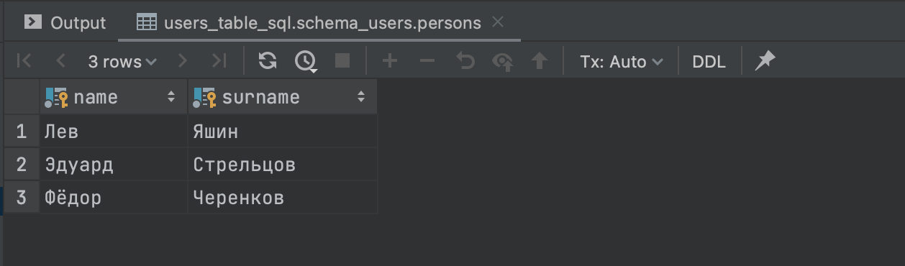

# Задача «Таблица пользователей»

## Описание

1. Скрипт создания таблицы с параметрами:

- название таблицы — `PERSONS`;
- содержит в себе 5 столбцов — `name`, `surname`, `age`, `phone_number`, `city_of_living`;
- первичным ключом будет сочетание `name`, `surname`, `age`.

2. Скрипт, который будет искать в таблице `PERSONS` поля `name` и `surname` пользователей, которые проживают в `MOSCOW`.

3. Скрипт, который будет искать в таблице `PERSONS` все поля, у которых поле `age` выше 54 лет. Отсортируйте получаемые результаты по убыванию возраста.

## Результат

### Таблица пользователей.

### Пользователи проживающие в Москве.

### Пользователи старше 54 лет.

